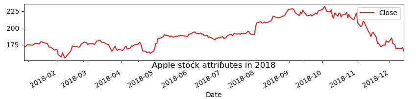
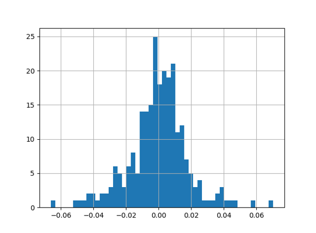
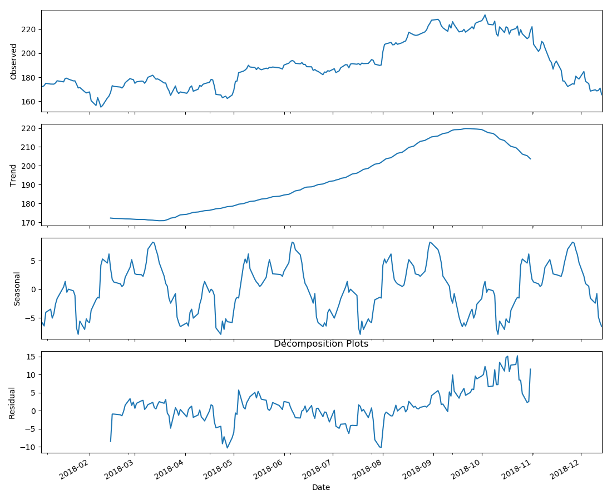
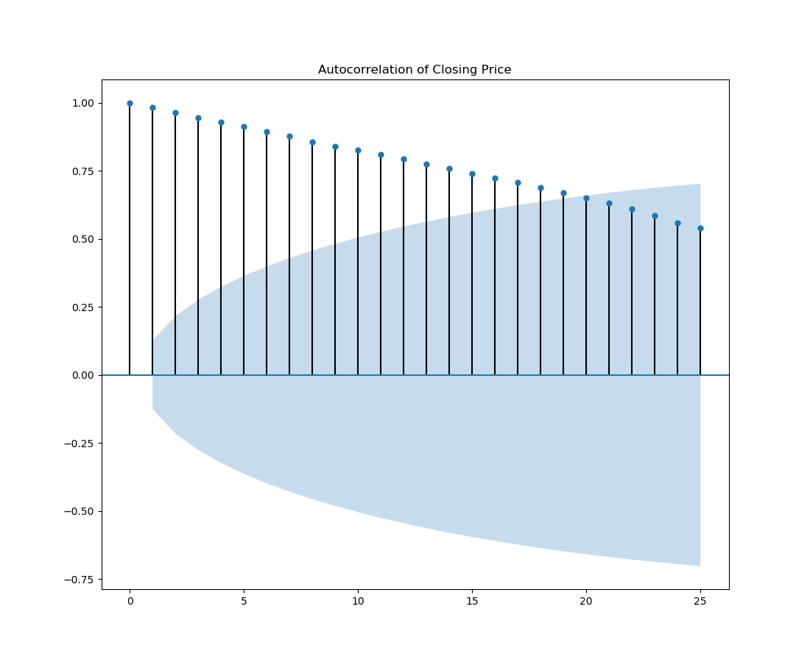
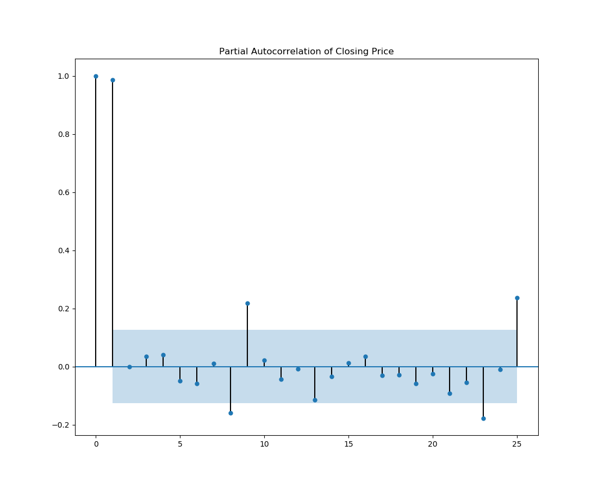
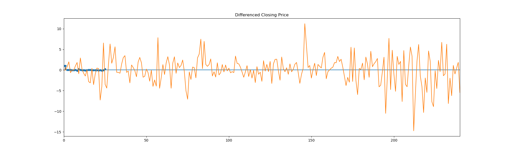
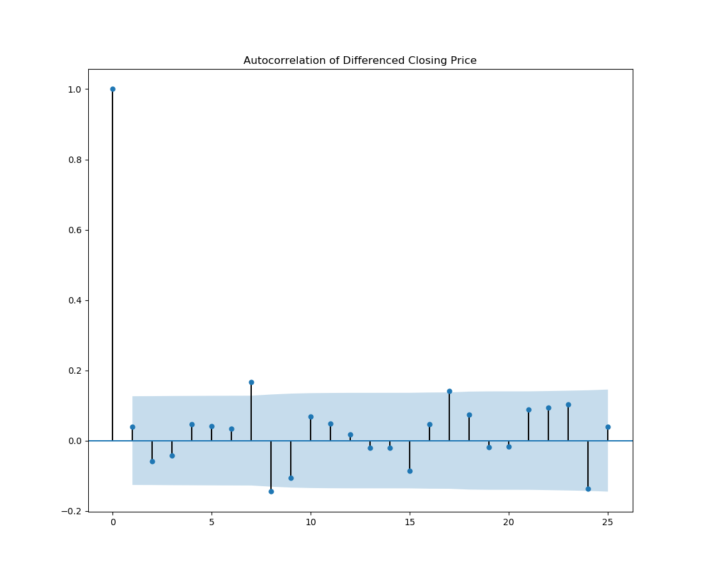
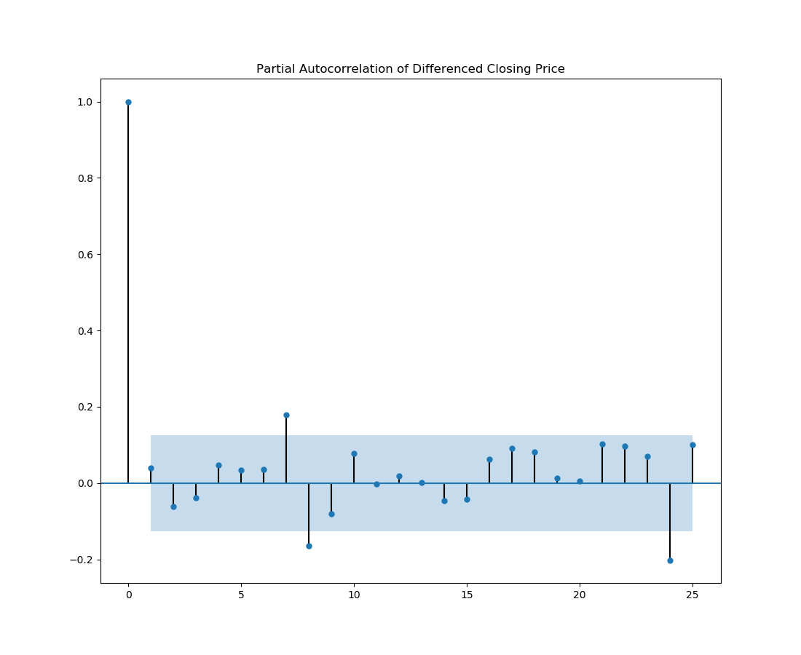
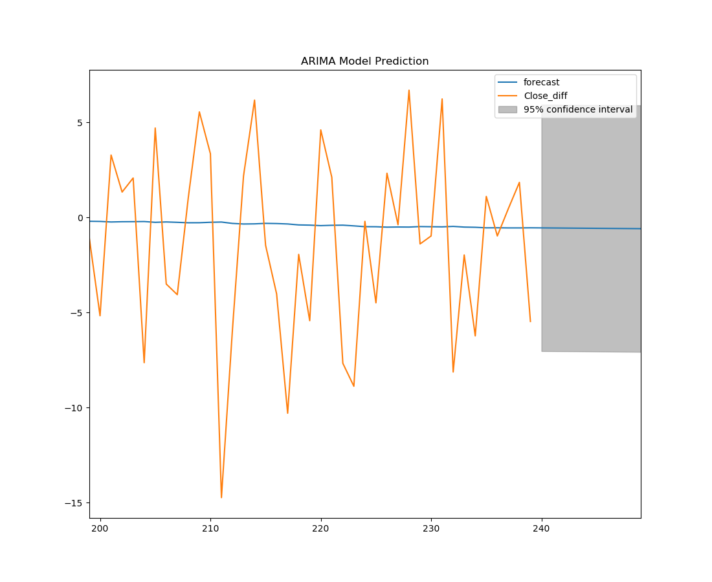

# Table of Contents
1. [Introduction](README.md#Introduction)
2. [Deployment](README.md#Deployment)
3. [Exploratory Data Analysis](README.md#exploratory-data-analysis)
4. [Modeling](README.md#Modeling)
5. [Conclusions](README.md#Conclusions)

## Introduction
In this project we attempt to model the price of apple's 2018 closing stock price and produce a short term forecast of a few days through ARIMA models. The data is collected by webscraping the data from yahoo finance https://finance.yahoo.com/quote/AAPL/history?p=AAPL by parsing through the HTML for the table. This webscraping process is handled by the script in web_scrap.py seperate from main.py where the modeling is done. Finally, the model is deployed as an Flask API hosted on Amazon Web Service (AWS). Please note, the model will forecast an inputted amount of days from 2018-12-14.

## Deployment
**1. To run this API, change your directory to the docker folder and run:**

`docker-compose up`

If it has created the localhost server correctly you will not get your prompt back. 

**2. You will need to open a new terminal (be in the same directory) and run the following curl command to get a response**

`curl http://localhost:5000/`

**3. We will pass these through a json formatted input through a curl POST request to the API. This is done as**

`curl -H "Content-Type: application/json" -X POST -d '{"days":"10"}' "http://13.57.212.119:5000/forecast_price"`

This should return 
`{
    "forecast price": [
        170.40439737, 
        170.39995174, 
        170.39550612, 
        170.39106049, 
        170.38661486,
        170.38216924, 
        170.37772361, 
        170.37327799, 
        170.36883236, 
        170.36438673
        ]
}`

You can change some of the values to see the prediction change. To stop your server running the API, type `ctrl-C`. As usual, check to see if you have any docker containers running using `docker container ls` and stop them through `docker container kill <container-name>`

## Exploratory Data Analysis
To begin, we do some exploratory analysis of the data and check the assumptions requirements for an ARIMA model.

The closing price chart

We note that the daily price change seems to be normally distributed

Decomposition for seasonality and trend

#### Stationarity
The data is considered to be stationary if it does not have trend or seasonal effects. That is, the data is not dependent on time.  
We check for stationarity of the closing price using the Augmented Dickey-Fuller test. If the p-value is greater than 0.05, then the test indicatets non-stationarity in the data.  
We get the result `p-value: 0.6779406322533845` indicating non-stationarity in the data so we need to adjust the data to become stationnary.  

Additionally we can check the ACF and PACF plots for autocorrelation

  
   

We see that there is large autocorrelation within the lagged values and geometric decay in our plots. This indicates we will have to transform our data to be stationary.

## Modeling
In order to build an ARIMA model, we must first transform the data to be stationary. To do this, we take the first difference of the closing price and recheck for stationarity.  

From the Augemented Fuller test we see the new p-value `p-value: 1.9555579579829498e-05`.  
This time the p-value is less than 0.05

  
   

The ACF and PACF now look reasonable within range.

We can now fit an ARIMA model.

#### Model Fitting
In order to choose the parameters p, d, q, we minimize the AIC. In the end, the most optimal model obtained was with parameters `p=0, d=1, q=1`  
Using the model we can make a forecast of price movement of next next x trading days with confidence levels.

Date  |  Forecasted Difference  |  Forecasted Price
:-----------:|:-----------------:|:--------------:
2018-12-17  |  4.924397  |  170.40439737
2018-12-18  |  -0.004446 |  170.39995174
2018-12-19  |  -0.004446 |  170.39550612
2018-12-20  |  -0.004446 |  170.39106049
2018-12-21  |  -0.004446 |  170.38661486
2018-12-24  |  -0.004446 |  170.38216924
2018-12-26  |  -0.004446 |  170.37772361
2018-12-27  |  -0.004446 |  170.37327799
2018-12-28  |  -0.004446 |  170.36883236
2018-12-31  |  -0.004446 |  170.36438673

To test the model we can evalueate the RMSE  
`RMSE: 5.0224385057219685`  
Since the rmse is relatively high compared to the data, the model was not accurate in making a prediction of the actual price. 

## Conclusions
It seems that ARIMA models are not a good fit for this particular data. One major limitation to this analysis is that only the closing price was taken into consideration for the model. The stock market is a complicated entity and often not driven by technical data alone. The overall market sector has some influence in the direction of a single stock in that sector.  It can also be influenced the emotion of investors and other non-technical factors. Therefore, when only the closing price is considered, the model will not be able predict for the effect of these other factors resulting in a low powerful prediction.
